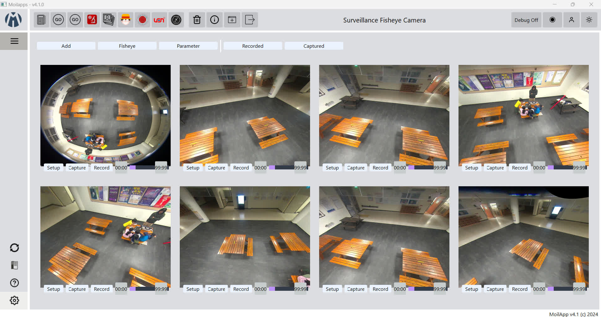
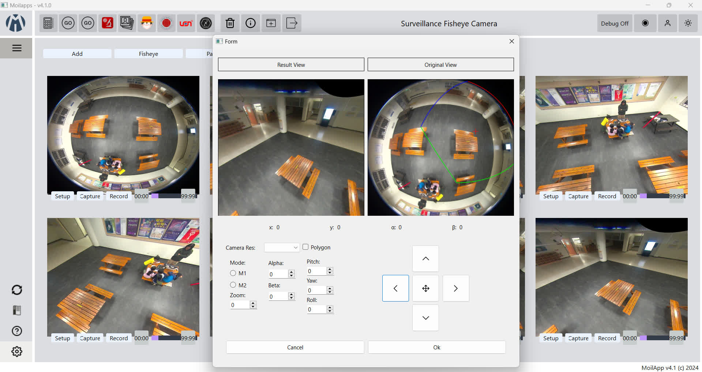

# Surveillance Plugin for MoilApp
Multimonitor for single or multiple camera sources with drag/drop and resizable monitors





How to turn Qt design and resource files into Python scripts
```bash
pyuic6 ui_main.ui -o ui_main.py

pyuic6 ui_tile.ui -o ui_tile.py

pyuic6 ui_setup.ui -o ui_setup.py

# change PyQt5 into PyQt6 manually
cd resources
pyrcc5 surveillance.qrc -o surveillance.py
```